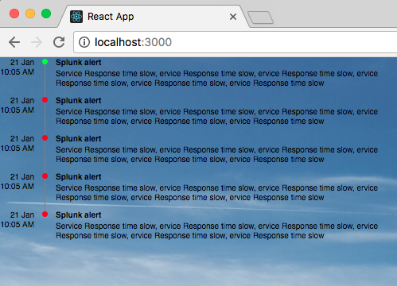

# rc-timeline

React Vertical Timeline Component.

[]

## Usage

```css
.rc-timeline-date {
  text-align: right;
  min-width: 43px;
}

.rc-timeline-title {
  font-size: 10px;
  font-weight: bold;
}

.rc-timeline-body {
  margin-top: 2px;
  font-size: 10px;
  margin-bottom: 10px;
}
```

```js
import React from 'react';
import ReactDOM from 'react-dom';
import { Timeline } from 'rc-timeline';
const data = [
    {
        date: new Date('1995-12-18T03:24:00'),
        color: '#00ff00',
        title: 'Splunk',
        body: 'Service Response time show'
    },
    {
        date: new Date('1995-12-18T03:24:00'),
        color: '#ff0000',
        title: 'Splunk',
        body: 'Service Response time show'
    },
    {
        date: new Date('1995-12-18T03:24:00'),
        color: '#ff0000',
        title: 'Splunk',
        body: 'Service Response time show'
    },
    {
        date: new Date('1995-12-18T03:24:00'),
        color: '#ff0000',
        title: 'Splunk',
        body: 'Service Response time show'
    },
    {
        date: new Date('1995-12-18T03:24:00'),
        color: '#ff0000',
        title: 'Splunk',
        body: 'Service Response time show'
    }
];
const leftRender = date => {
    const momentDate = moment(date);
    return <div className="rc-timeline-date">
        <div>{momentDate.format('DD MMM')}</div>
        <div>{momentDate.format('HH:mm A')}</div>
    </div>
};

const rightRender = item => {
    return <div>
        <div className="rc-timeline-title">{item.title}</div>
        <div className="rc-timeline-body">{item.body}</div>
    </div>
};

ReactDOM.render(<Timeline data={data} leftRender={leftRender} rightRender={rightRender} />, rootEl);
```